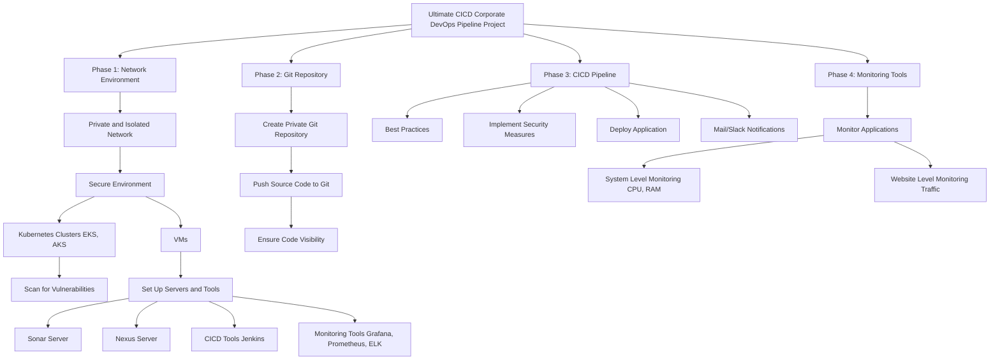

# 🚀 Ultimate DevSecOps CI/CD Pipeline – Real-Time Enterprise-Ready Project





---

This project demonstrates a **real-time, end-to-end DevSecOps CI/CD pipeline** built to mirror production-grade enterprise infrastructure, emphasizing **security, scalability, observability**, and **automation**.

---

### 📊 DevSecOps Architecture – Animation Flow Diagram (CI/CD Lifecycle)

```
+-------------------+
|   Git Repository  |
| (Private + Secure)|
+-------------------+
         |
         v
+-------------------+        +---------------------------+
| Jenkins CI/CD     | -----> | Gitleaks (Secrets Scan)   |
| Pipeline Trigger  |        +---------------------------+
         |
         v
+----------------------------+
| Maven Build & Unit Tests  |
+----------------------------+
         |
         v
+---------------------------+     +---------------------------+
| SonarQube (Code Quality) | --> | Quality Gate Enforcement   |
+---------------------------+     +---------------------------+
         |
         v
+----------------------------+
| OWASP Dependency Check     |
| & Trivy FS Scan            |
+----------------------------+
         |
         v
+---------------------------+
| Docker Image Build & Push |
| (Docker Hub/Nexus)        |
+---------------------------+
         |
         v
+----------------------------+
| Trivy Image Scan (Runtime)|
+----------------------------+
         |
         v
+---------------------------+
| Kubernetes Deployment     |
| (EKS / AKS / K8s Native)  |
+---------------------------+
         |
         v
+----------------------------+
| Observability Stack:       |
| Prometheus + Grafana       |
| ELK Stack (Logs)           |
+----------------------------+
```

---

## ✅ Project Execution Phases (Production-Grade Breakdown)

### **📌 Phase 1: Infrastructure & Environment Provisioning**

* Designed a **private and secure VPC/network architecture** for isolated deployments.
* Provisioned **Kubernetes clusters** (or managed services like **EKS**, **AKS**) to host microservices in a scalable, secure manner.
* Deployed essential tooling stack:

  * **Jenkins (CI/CD orchestrator)**
  * **SonarQube** for code quality management
  * **Nexus** for artifact management
  * **ELK Stack**, **Grafana**, and **Prometheus** for full-stack monitoring.
* Hardened cluster and VM environments with security best practices and access control (RBAC, IAM, firewall rules).

---

### **📌 Phase 2: Source Control & Repository Configuration**

* Created a **private Git repository** to host source code and infrastructure-as-code (IaC).
* Pushed and versioned the application code; implemented **branch protection**, commit signing, and review workflows.
* Integrated Git with Jenkins via webhooks to automate build triggers on each commit.

---

### **📌 Phase 3: CI/CD Pipeline – Automation & Security Integration**

* Developed a **modular Jenkins pipeline** with stages for build, test, code quality, security scans, and deployment.
* Integrated **Gitleaks**, **OWASP Dependency-Check**, and **Trivy** for layered security:

  * Secrets detection
  * Dependency vulnerability scanning
  * Container image scanning
* Ensured **quality gate enforcement via SonarQube** — failed pipelines on any major code smell, vulnerability, or low test coverage.
* **Built versioned Docker images**, pushed to Docker Hub with secure credential injection.
* Enabled **Slack/Email notifications** for pipeline success, failure, or quality alerts.

---

### **📌 Phase 4: Deployment & Monitoring**

* Deployed Dockerized applications to Kubernetes using **templated manifests** with `envsubst` for dynamic image versioning.
* Set up **horizontal pod autoscaling (HPA)** and readiness/liveness probes.
* Implemented **monitoring at two levels**:

  * **System level**: CPU, RAM, Disk using **Prometheus Node Exporter** and Grafana dashboards.
  * **Application level**: Response time, error rate, traffic metrics using **Kube-state-metrics** and custom PromQL queries.
* Configured centralized logging using **ELK Stack** for real-time debugging and alerting.

---


# BoardgameListingWebApp

## Description

**Board Game Database Full-Stack Web Application.**
This web application displays lists of board games and their reviews. While anyone can view the board game lists and reviews, they are required to log in to add/ edit the board games and their reviews. The 'users' have the authority to add board games to the list and add reviews, and the 'managers' have the authority to edit/ delete the reviews on top of the authorities of users.  

## Technologies

- Java
- Spring Boot
- Amazon Web Services(AWS) EC2
- Thymeleaf
- Thymeleaf Fragments
- HTML5
- CSS
- JavaScript
- Spring MVC
- JDBC
- H2 Database Engine (In-memory)
- JUnit test framework
- Spring Security
- Twitter Bootstrap
- Maven

## Features

- Full-Stack Application
- UI components created with Thymeleaf and styled with Twitter Bootstrap
- Authentication and authorization using Spring Security
  - Authentication by allowing the users to authenticate with a username and password
  - Authorization by granting different permissions based on the roles (non-members, users, and managers)
- Different roles (non-members, users, and managers) with varying levels of permissions
  - Non-members only can see the boardgame lists and reviews
  - Users can add board games and write reviews
  - Managers can edit and delete the reviews
- Deployed the application on AWS EC2
- JUnit test framework for unit testing
- Spring MVC best practices to segregate views, controllers, and database packages
- JDBC for database connectivity and interaction
- CRUD (Create, Read, Update, Delete) operations for managing data in the database
- Schema.sql file to customize the schema and input initial data
- Thymeleaf Fragments to reduce redundancy of repeating HTML elements (head, footer, navigation)

## How to Run

1. Clone the repository
2. Open the project in your IDE of choice
3. Run the application
4. To use initial user data, use the following credentials.
  - username: bugs    |     password: bunny (user role)
  - username: daffy   |     password: duck  (manager role)
5. You can also sign-up as a new user and customize your role to play with the application! 😊
